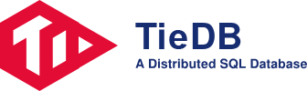
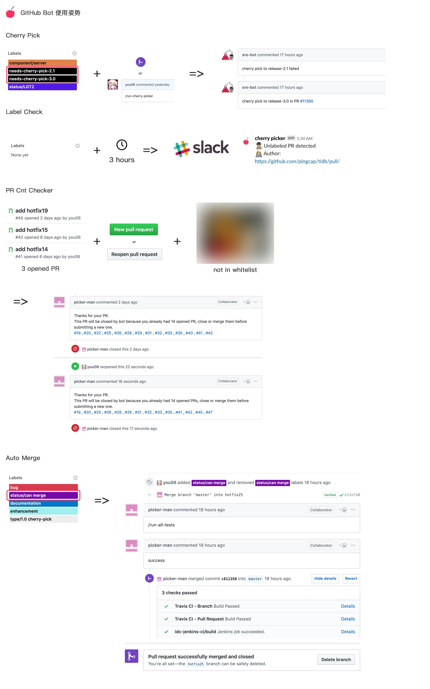

## What is TieDB?

TieDB ("Tie" stands for Ferrum) is an open-source NewSQL database that supports Hybrid Transactional and Analytical Processing (HTAP) workloads. It is TiDB compatible and features horizontal scalability, strong consistency, and high availability.

## Benchmark

[Doc](docs/benchmark.md)

## Bot

## Test
